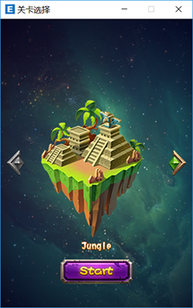

# LevelSelectExample-Easy2D

一个简单的关卡选择示例

## 运行方法

1. 在安装了 Git 的终端上运行 `git clone https://github.com/Easy2D/LevelSelectExample-Easy2D.git`
2. 打开项目目录下的 `.sln` 文件
3. 编译并启动！

## 运行预览

## 下载

[下载页面](//github.com/Easy2D/LevelSelectExample-Easy2D/releases)
